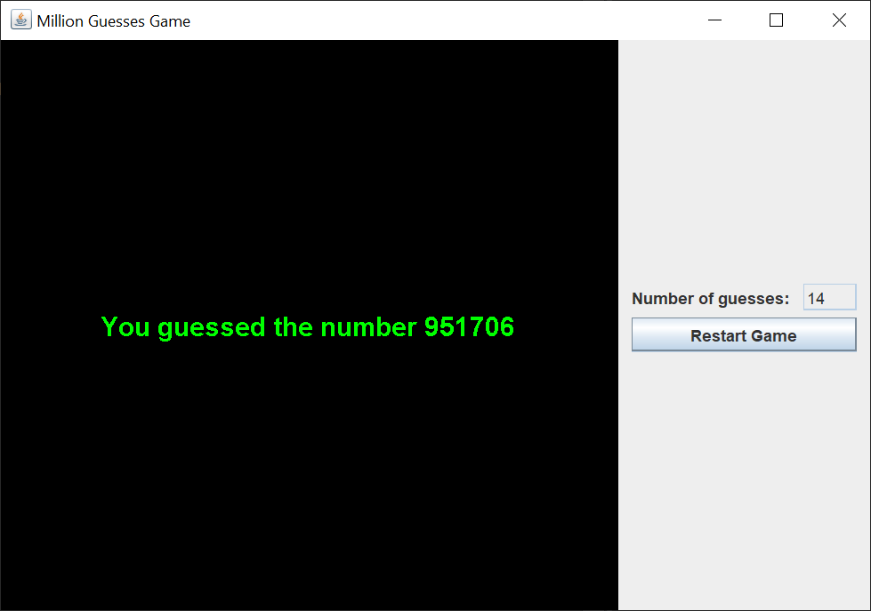
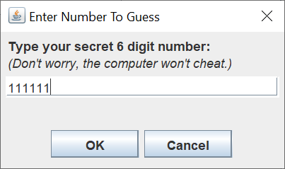
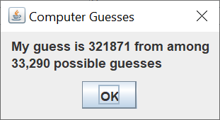
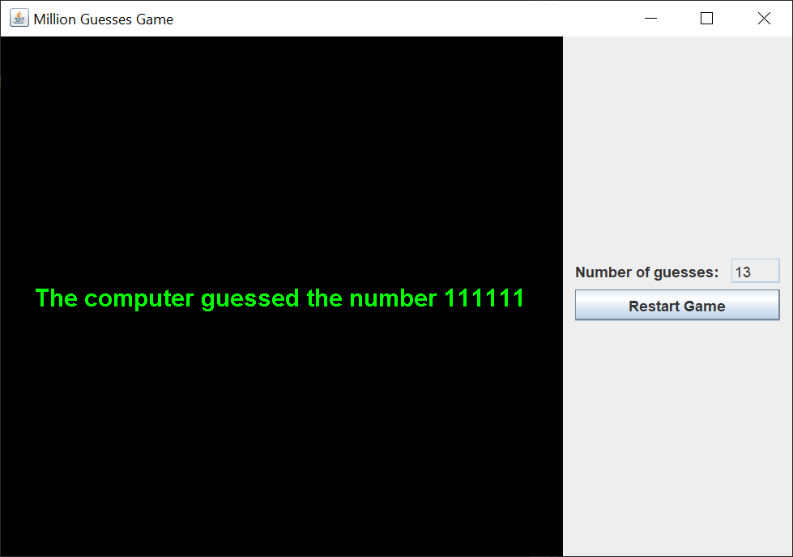

# Million Guesses Game

## Introduction

About a month ago, someone posted a question on Stack Overflow about a Mastermind-type game.  The object of the game is to guess a secret six digit number from `000000` through `999999`.  Your only clues are the number of digits in the correct position and the number of correct digits in the wrong position.

I decided that this would make an interesting Swing GUI, so I coded up the game.

Here's what the GUI looks like when you start the game.

After you left-click on the "Start Game" button, you see the following dialog.

Left-clicking on the "OK" button causes the computer to pick the number for you, the player, to guess.  You'll see a sequence of the following dialog.

You'll see your previous guesses on the table on the left.  The most recent guesses are at the top of the table.  You can keep guessing until you guess the number.  Or, you can left-click the "Cancel" button to give up.  Either way, the GUI shows you the secret number. 

If you let the computer guess your number, you'll see the following dialog.

You enter your number so the computer can calculate the digits in the correct position and correct disgits for you.  The computer picks a random number from among the possible numbers that match the results from the previous guesses.

The computer can usually guess your number in 8 guesses or less.

## Strategy

The only reasonable human strategy I've come up with is to guess `000000`, `111111`, through `888888`.  This gives you the digits in the secret number.  From then, it's a matter of arranging the digits in the correct order.  You'll take anywhere from 30 - 60 guessess to guess the secrent number.

The computer uses all the information given to narrow down the possible guessses,  The computer can guess the secret number in 8 tries or less.

## Explanation

Oracle has a helpful tutorial, [Creating a GUI With Swing](https://docs.oracle.com/javase/tutorial/uiswing/index.html).  Skip the Learning Swing with the NetBeans IDE section.

When I create a Swing GUI, I use the [model-view-controller](https://en.wikipedia.org/wiki/Model%E2%80%93view%E2%80%93controller) (MVC) pattern.  This pattern allows me to separate my concerns and focus on one part of the Swing application at a time.

A Swing model is made up of one or more plain Java getter/setter classes.

A Swing view consists of one `JFrame`, as many `JPanels` as you need, and as many `JDialogs` as you need.

A Swing controller is made up of many `Listeners` and `Actions`.  Each `Listener` or `Action` is responsibile for updating its part of the model and revalidating/repainting its part of the view.

### Model

I created two model classes.

The `Guess` class holds a guess, the correct position count, and the correct digits count.  This class is used both to hold player guesses as well as computer guesses.

The `MillionGuessesModel` class holds a `DefaultTableModel` to display the guesses, the secret number, and a `boolean` flag to indicate whether the computer is guessing or the player is guessing.

### View

I used a `JFrame` to hold a `JTable` and a control `JPanel`.  The `JTable` is placed in a `JScrollPane`.  The `JFrame` has a default `BorderLayout`.  The `JScrollPane` `JPanel` is shown in the center of the `BorderLayout`.  The control `JPanel` is placed in the east of the `BorderLayout`.

Guesses are added to the beginning of the `JTable`.  This way, players don't have to scroll to see the latest guesses.

The control `JPanel` displays the number of guesses taken by either the player or the computer and the start/restart `JButton`.

The main `JPanel` uses a `CardLayout` to hold the `JTable` in one `JPanel` and the image `JPanel` in another `JPanel`.  This allows the game to swap the JTable `JPanel` with the image `JPanel`.

There are four `JDialogs` that collect information from the player or display information to the player.  Games will generally have multiple `JDialogs` to keep the main `JFrame` from displaying too much information.

### Controller

There are three controller classes.

The `StartButtonListener` class resets the model and view and determines whether the player or the computer will guess the secret number.

The `PlayerTimerListener` class displays the `PlayerGuessDialog` and gets the player's guesses.  This listener is part of a Swing `Timer` so the dialogs will appear 5 seconds apart.

The `ComputerTimerListener` class displays the `ComputerGuessDialog` and displays the computer's guesses.  This listener is part of a Swing `Timer` so the dialogs will appear 5 seconds apart.  The computer goes through all the numbers from 0 to 999,999, compares them with the previous guesses, and picks a number to guess at random when there's more than one possible number that gives the same results as the previous guesses,
