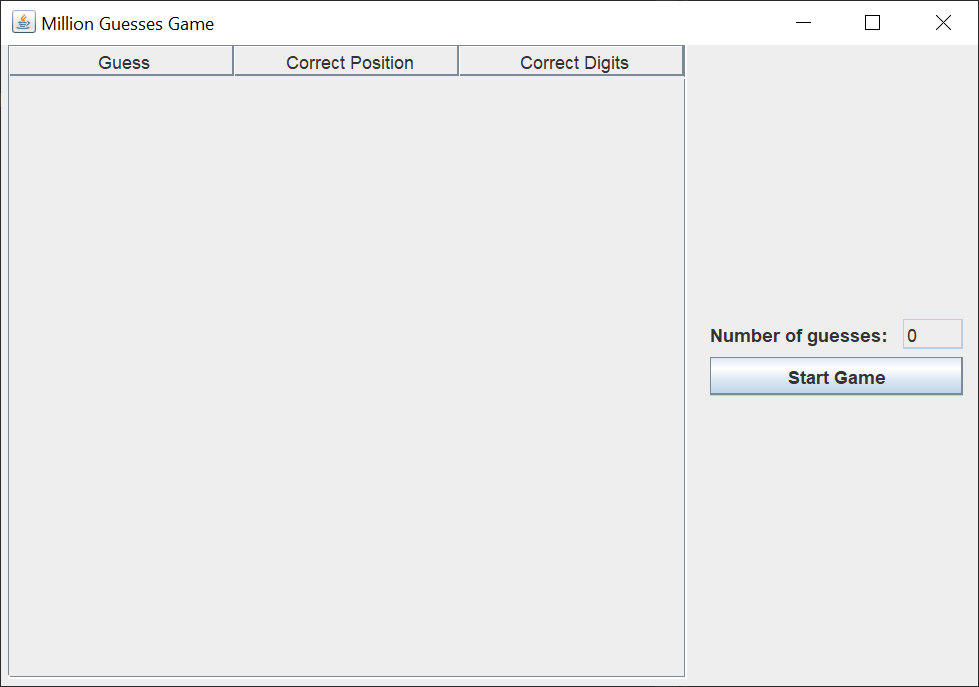
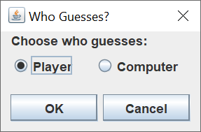
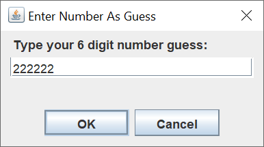

# Million Guesses Game

## Introduction

About a month ago, someone posted a question on Stack Overflow about a mastermind-type game.  The object of the game is to guess a six digit number from `000000` through `999999`.  Your only clues are the number of digits in the correct position and the number of correct digits in the wrong position.

I decided that this would make an interesting Swing GUI, so I coded up the game.

Here's what the GUI looks like when you start the game.

After you left-click on the "Start Game" button, you see the following dialog.

Left-clicking on the "OK" button causes the computer to pick the number for you, the player, to guess.  You'll see a sequence of the following dialog.

You'll see your previous guesses on the table on the left.  You can keep guessing until you guess the number.  Or, you can 
